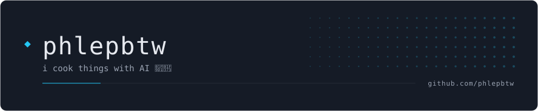
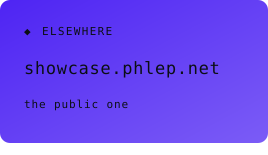
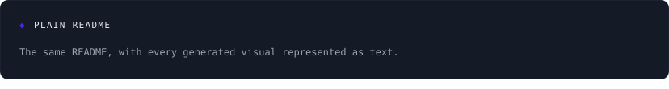
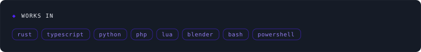

<!-- readme-build:begin banner -->

<!-- readme-build:end banner -->

<!-- readme-build:begin badges -->
<!-- readme-build:end badges -->

<!-- readme-build:begin bento -->

<!-- readme-build:end bento -->

<!-- readme-build:begin video -->
<!-- readme-build:end video -->

<!-- readme-build:begin activity -->
<!-- readme-build:end activity -->
